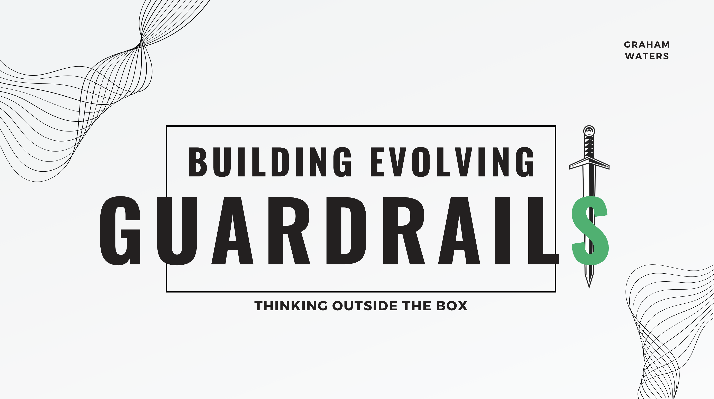

# GenAI on GuardRails
Protecting your PID, IP, and Company secrets while using GenAI.

# Introduction

Building Guardrails for Yourself and Your Company with Python while Using Generative AI Tools

Data scientists, analysts, and every person across a multidisciplinary spectrum at any organization must consider implementing guardrails immediately for their employees that don't limit the potential of how AI will revolutionize the world but keep it in check to prevent their PII and IP from slipping into the ether of the regenerative reinforcement algorithm that feeds OpenAI's excellent new toolkit. In addition, It's easy to assume that the machine must be correct because it usually is. But in reality, a machine is simply a mechanical brain, and brains are sometimes wrong and even hallucinate. We must discuss these topics to move forward as organizations that thrive in the new age of AI.

# Preface
This is a simple guide to help you protect your PID, IP, and Company secrets while using GenAI. This guide is not meant to be a comprehensive guide to security, but rather a simple guide to help you get started.

There are many facets to consider when securing your GenAI environment. To hone in on the "one thing" (to quote Gary Keller and Jay Papasan) that you can do to protect your PID, IP, and Company secrets, is difficult because it's an evolving issue. There are more and more tools being developed every day that can counterman the latest security threats, while equal numbers of vectors for attack are being developed. Something we often forget is that security is a process, not a destination. It's a journey, not a destination. It's a marathon, not a sprint. It's a bunch of other cliches as well. The point is, security is a process that requires constant vigilance and attention. It's not something you can set and forget. It's not something you can do once and be done with it. It's something you have to constantly be aware of and constantly be working on.

At engage2Learn I've been working with our Tiger Team to develop security protocols for how we can and cannot use GenAI. This is a living document that will be updated as we learn more about the security landscape and as we develop more tools to help us protect our PID, IP, and Company secrets. I heard the other day that with only 15 data points a person's anonymized PID can be identified with 99.98% accuracy. Fifteen may seem like a lot of data points at first, but in actuality, think of how many lines you fill out when you use a website, go to the doctor, or even just use your phone. It's not hard to get to 15 data points. And once you're there, you're no longer anonymous.
"""
“We need to move beyond de-identification,” he said. “Anonymity is not a property of a data set, but is a property of how you use it.”
The balance is tricky: Information that becomes completely anonymous also becomes less useful, particularly to scientists trying to reproduce the results of other studies. But every small bit that is retained in a database makes identification of individuals more possible.

“Very quickly, with a few bits of information, everyone is unique,” said Dr. Erlich.
"""

<h1> What we need are better Anonymization Techniques </h1>
<h2> Guardrails for the new GenAI-Age </h2>

<!-- embed this url -->
<!-- https://www.canva.com/design/DAFl1lG6kMY/zf6vNj2_jhlMb3qVn6eLKQ/view -->
<!-- in an iframe -->
click this url to visit the presentation website: https://www.canva.com/design/DAFl1lG6kMY/zf6vNj2_jhlMb3qVn6eLKQ/view